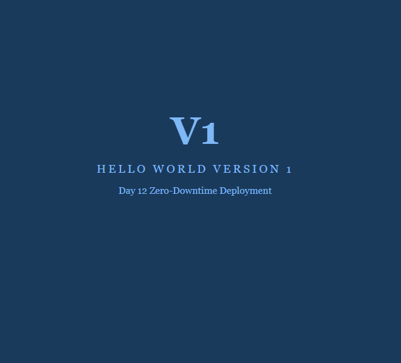
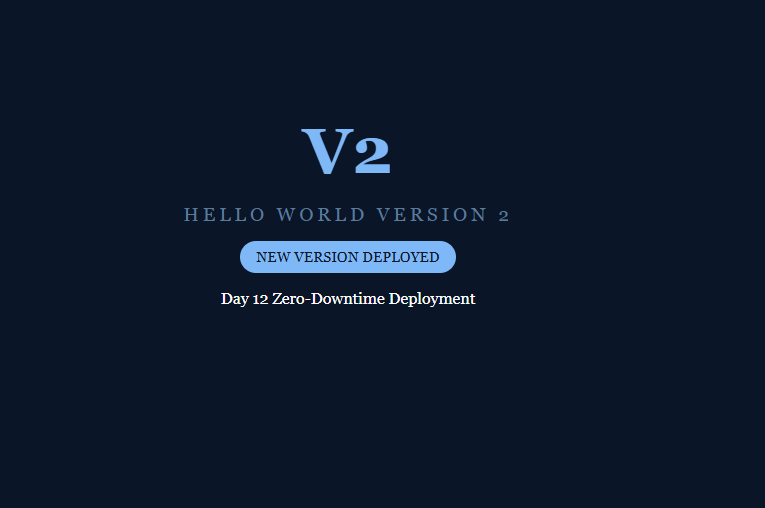
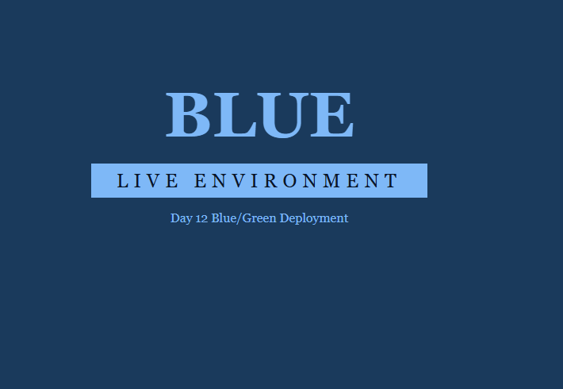
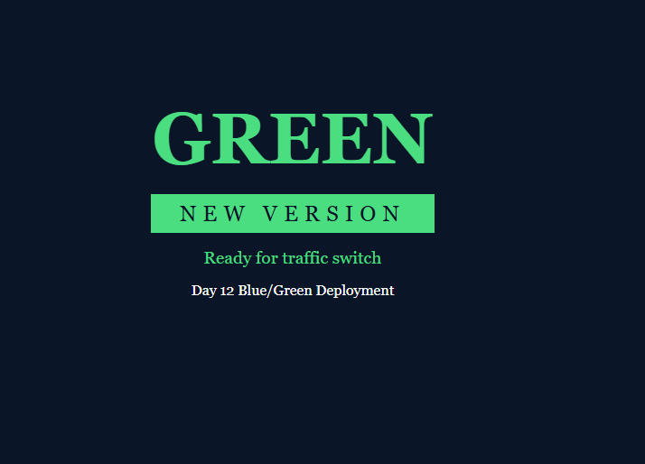
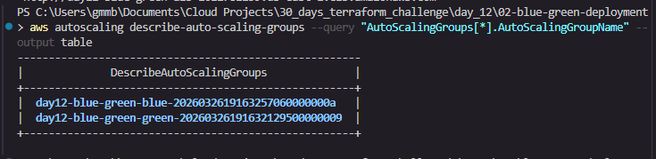
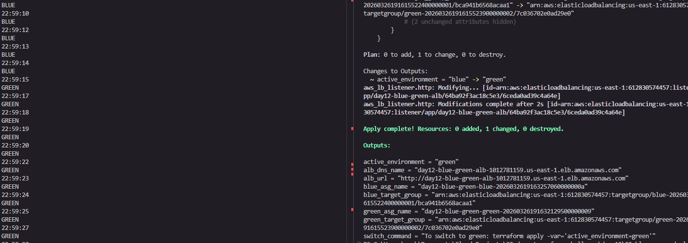

# Day 12 — Zero Downtime Deployments with Terraform

## Table of Contents
- [Overview](#overview)
- [What is Zero Downtime Deployment?](#what-is-zero-downtime-deployment)
- [Project Structure](#project-structure)
- [Pattern 01 — Rolling Deployment (Zero Downtime)](#pattern-01--rolling-deployment-zero-downtime)
- [Pattern 02 — Blue/Green Deployment](#pattern-02--bluegreen-deployment)
- [How to Deploy](#how-to-deploy)
- [Testing](#testing)
- [Errors Encountered](#errors-encountered)
- [Key Takeaways](#key-takeaways)
- [Conclusion](#conclusion)
- [Connect With Me](#connect-with-me)

---

## Overview

This project demonstrates two production-grade zero downtime deployment strategies using Terraform on AWS. Both patterns ensure that users never experience an outage or blank response when a new version of an application is deployed.

The two patterns covered are:

| Pattern | Strategy | Switch Time |
|---|---|---|
| 01 | Rolling Deployment (create_before_destroy) | 3–5 minutes |
| 02 | Blue/Green Deployment | 1–2 seconds |

---

## What is Zero Downtime Deployment?

When you update a web application, the naive approach is to shut down the old servers and start new ones. During that gap, users get errors. Zero downtime deployment solves this by ensuring new servers are healthy and serving traffic **before** old servers are removed.

There are two common strategies:

- **Rolling Deployment** — gradually replaces old instances with new ones. The load balancer keeps routing traffic throughout the process.
- **Blue/Green Deployment** — runs two identical environments (blue = current, green = new). Traffic is switched instantly from one to the other at the load balancer level.

---

## Project Structure

```
day_12/
├── 01-basic-zero-downtime/       # Pattern 01 — Rolling deployment
│   ├── main.tf
│   ├── variables.tf
│   ├── outputs.tf
│   ├── user-data-v1.sh           # Version 1 web page
│   └── user-data-v2.sh           # Version 2 web page
├── 02-blue-green-deployment/     # Pattern 02 — Blue/Green deployment
│   ├── main.tf
│   ├── variables.tf
│   ├── outputs.tf
│   ├── user-data-blue.sh         # Blue environment web page
│   └── user-data-green.sh        # Green environment web page
├── images/                       # Screenshots and proof
└── .gitignore
```

---

## Pattern 01 — Rolling Deployment (Zero Downtime)

### How It Works

This pattern uses an **Auto Scaling Group (ASG)** with a **Launch Template** and Terraform's `create_before_destroy` lifecycle rule. When you deploy a new version:

1. Terraform creates a **new Launch Template** with the new user data (V2)
2. Terraform creates a **new ASG** with V2 instances
3. The new ASG registers its instances with the **ALB Target Group**
4. Terraform waits for the new instances to pass **ELB health checks** (`min_elb_capacity`)
5. Only after the new instances are healthy does Terraform **destroy the old ASG**

This guarantees that at no point is the ALB left without healthy targets.

### Architecture

```
Internet
    │
    ▼
[Application Load Balancer]
    │
    ▼
[Target Group]
    │
    ├── [ASG V1 instances]  ← destroyed after V2 is healthy
    └── [ASG V2 instances]  ← created first, must pass health checks
```

### Key Terraform Concepts Used

- `create_before_destroy = true` — tells Terraform to create the replacement resource before destroying the old one
- `random_id` with `keepers` — generates a new ID whenever the AMI or user data changes, forcing a new ASG to be created
- `min_elb_capacity` — Terraform waits until this many instances are healthy in the ALB before proceeding
- `name_prefix` instead of `name` — allows multiple versions of the same resource to exist simultaneously without name conflicts

### Infrastructure Resources

| Resource | Purpose |
|---|---|
| `aws_launch_template.web` | Defines instance config (AMI, instance type, user data) |
| `aws_autoscaling_group.web` | Manages the fleet of EC2 instances |
| `aws_lb.web` | Application Load Balancer — public entry point |
| `aws_lb_target_group.web` | Health checks and routes traffic to instances |
| `aws_lb_listener.http` | Listens on port 80 and forwards to target group |
| `aws_security_group.instance` | Allows traffic from ALB to instances on port 80 |
| `aws_security_group.alb` | Allows public HTTP traffic to ALB |

### Variables

| Variable | Default | Description |
|---|---|---|
| `cluster_name` | `day12-zero-downtime` | Prefix for all resource names |
| `ami_id` | `ami-0c02fb55956c7d316` | Amazon Linux 2 AMI (us-east-1) |
| `instance_type` | `t2.micro` | EC2 instance size |
| `min_size` | `2` | Minimum instances in ASG |
| `max_size` | `4` | Maximum instances in ASG |
| `server_port` | `80` | Port the web server listens on |
| `user_data_script` | `user-data-v1.sh` | Which version to deploy |

---

## Pattern 02 — Blue/Green Deployment

### How It Works

This pattern runs **two complete, identical environments** at all times — Blue (current live) and Green (new version). The ALB listener points to only one at a time. Switching is done by updating the listener's target group, which takes **1–2 seconds**.

1. Both Blue and Green ASGs are always running with healthy instances
2. The ALB listener forwards traffic to whichever environment is set as `active_environment`
3. To deploy a new version, you update the Green environment and switch traffic with a single Terraform variable change
4. If something goes wrong, you switch back to Blue instantly — this is called a **rollback**

### Architecture

```
Internet
    │
    ▼
[Application Load Balancer]
    │
    ▼
[Listener — forwards to active environment]
    │
    ├── [Blue Target Group]  ←── Blue ASG (2 instances)
    └── [Green Target Group] ←── Green ASG (2 instances)

Only one target group receives traffic at a time.
Switch is controlled by: var.active_environment = "blue" | "green"
```

### Key Terraform Concepts Used

- Ternary expression for traffic switching:
  ```hcl
  target_group_arn = var.active_environment == "blue" ? aws_lb_target_group.blue.arn : aws_lb_target_group.green.arn
  ```
- Two separate ASGs and Launch Templates running simultaneously
- Two separate Target Groups — one per environment
- Single ALB and Listener — only the forwarding rule changes

### Variables

| Variable | Default | Description |
|---|---|---|
| `cluster_name` | `day12-blue-green` | Prefix for all resource names |
| `active_environment` | `blue` | Which environment receives live traffic |
| `min_size` | `2` | Minimum instances per ASG |
| `max_size` | `4` | Maximum instances per ASG |

---

## How to Deploy

### Prerequisites

- Terraform installed
- AWS CLI configured with valid credentials
- An AWS account with permissions to create EC2, ALB, ASG, and Security Group resources

### Pattern 01 — Deploy V1

```bash
cd 01-basic-zero-downtime
terraform init
terraform apply -var="user_data_script=user-data-v1.sh" -auto-approve
```

### Pattern 01 — Deploy V2 (Rolling Update)

```bash
terraform apply -var="user_data_script=user-data-v2.sh" -auto-approve
```

### Pattern 02 — Deploy Blue/Green

```bash
cd 02-blue-green-deployment
terraform init
terraform apply -var="active_environment=blue" -auto-approve
```

### Pattern 02 — Switch to Green

```bash
terraform apply -var="active_environment=green" -auto-approve
```

### Pattern 02 — Rollback to Blue

```bash
terraform apply -var="active_environment=blue" -auto-approve
```

---

## Testing

### Pattern 01 — V1 to V2 Rolling Deployment Test

The goal is to prove that traffic never drops during a rolling deployment from V1 to V2.

**Open two terminals:**

**Terminal 1 — Start the traffic loop (keep running):**

```powershell
while ($true) { try { $content = (Invoke-WebRequest -Uri "http://<YOUR_ALB_URL>" -UseBasicParsing).Content; if ($content -match '<div class="container">') { $content | Select-String -Pattern "Version [12]" } else { "unknown" } } catch { "waiting..." }; Get-Date -Format "HH:mm:ss"; Start-Sleep 2 }
```

**Terminal 2 — Deploy V2:**

```bash
terraform apply -var="user_data_script=user-data-v2.sh" -auto-approve
```

**What happens step by step:**

1. Terraform creates a new Launch Template with V2 user data
2. Terraform creates a new ASG — new EC2 instances boot up with V2
3. New instances register with the ALB Target Group
4. Terraform waits for V2 instances to pass health checks (`min_elb_capacity = 2`)
5. Once healthy, Terraform destroys the old V1 ASG
6. Total time: **3–5 minutes**

**Expected terminal output:**

```
Version 1  ← V1 serving traffic
14:22:01
Version 1
14:22:03
Version 1
14:22:05
Version 2  ← V2 instances healthy, traffic switched
14:22:07
Version 2
14:22:09
```

**Result: No errors, no timeouts, no blank responses. Clean V1 → V2 transition.**

### Proof — V1 Browser Output


### Proof — V2 Browser Output


### Proof — V1 to V2 Traffic Loop


---

### Pattern 02 — Blue/Green Switch Test

The goal is to prove that switching between Blue and Green is near-instant (1–2 seconds).

**Open two terminals:**

**Terminal 1 — Start the traffic loop (keep running):**

```powershell
while ($true) { try { $content = (Invoke-WebRequest -Uri "http://<YOUR_ALB_URL>" -UseBasicParsing).Content; if ($content -match '<div class="env">BLUE') { "BLUE" } elseif ($content -match '<div class="env">GREEN') { "GREEN" } else { "unknown" } } catch { "waiting..." }; Get-Date -Format "HH:mm:ss"; Start-Sleep 1 }
```

> Note: We match against `<div class="env">` specifically to avoid false matches on the text "Blue/Green Deployment" that appears in both pages.

**Terminal 2 — Switch to Green:**

```bash
terraform apply -var="active_environment=green" -auto-approve
```

**What happens step by step:**

1. Terraform updates only the ALB Listener's `target_group_arn`
2. The listener now forwards traffic to the Green Target Group
3. Both ASGs remain running — no instances are created or destroyed
4. Total time: **1–2 seconds**

**Expected terminal output:**

```
BLUE   ← Blue is live
22:52:23
BLUE
22:52:24
BLUE
22:52:25
GREEN  ← Listener switched, Green is now live
22:52:26
GREEN
22:52:27
```

**To switch back (rollback):**

```bash
terraform apply -var="active_environment=blue" -auto-approve
```

**Result: Switch happens in 1–2 seconds. No downtime, no waiting for health checks.**

### Proof — Blue Browser Output


### Proof — Green Browser Output


### Proof — Both ASGs Running Simultaneously


### Proof — Blue Switching to Green


---

## Errors Encountered

### Error 1 — `name_prefix` cannot be longer than 6 characters

```
Error: "name_prefix" cannot be longer than 6 characters

  with aws_lb_target_group.web,
  on main.tf line 127, in resource "aws_lb_target_group" "web":
 127:   name_prefix = "${var.cluster_name}-"
```

**Cause:** AWS enforces a strict 6-character limit on the `name_prefix` field for `aws_lb_target_group`. The cluster name `day12-zero-downtime` plus the `-` separator exceeded this limit.

**Fix:** Use Terraform's `substr` function to truncate the prefix to 4 characters, keeping the total (including `-`) at 5 characters — safely under the limit:

```hcl
name_prefix = "${substr(var.cluster_name, 0, 4)}-"
```

---

### Error 2 — State file locked during `terraform output`

```
Error: Failed to read state file
The state file could not be read: read terraform.tfstate: The process cannot
access the file because another process has locked a portion of the file.
```

**Cause:** Running `terraform output` inside a loop while `terraform apply` was running in another terminal caused a state file lock conflict. Terraform locks the state file during apply to prevent concurrent modifications.

**Fix:** Hardcode the ALB URL directly in the monitoring loop instead of calling `terraform output` on every iteration:

```powershell
# Instead of this (causes lock conflict):
while ($true) { $url = terraform output -raw alb_url; ... }

# Do this (hardcode the URL):
while ($true) { (Invoke-WebRequest -Uri "http://<YOUR_ALB_URL>" ...) }
```

---

### Error 3 — Pattern matching showing wrong environment

**Cause:** The monitoring loop was matching `BLUE` or `GREEN` against the full HTML content. Both pages contain the text "Blue/Green Deployment" in a paragraph tag, causing false matches regardless of which environment was active.

**Fix:** Match against the specific `<div class="env">` element that contains only the environment name:

```powershell
if ($content -match '<div class="env">BLUE') { "BLUE" }
elseif ($content -match '<div class="env">GREEN') { "GREEN" }
```

---

## Key Takeaways

| | Pattern 01 (Rolling) | Pattern 02 (Blue/Green) |
|---|---|---|
| Switch time | 3–5 minutes | 1–2 seconds |
| Instances during deploy | Old + New running briefly | Both always running |
| Rollback speed | 3–5 minutes | 1–2 seconds |
| Cost | Normal | 2x instance cost (both envs always on) |
| Best for | Cost-sensitive workloads | Production apps needing instant rollback |

- `create_before_destroy` is the foundation of zero downtime in Terraform — always create the replacement before removing the original
- `min_elb_capacity` is critical — without it, Terraform would destroy old instances before new ones are healthy
- Blue/Green is faster because it only changes a single ALB listener rule — no instances are created or destroyed during the switch
- Always use `name_prefix` instead of `name` for resources that need to be replaced in-place, to avoid name conflicts during the transition period

---

## Conclusion

Day 12 was one of the most hands-on and rewarding days of the 30-day Terraform challenge. The concept of zero downtime deployments is something every cloud engineer needs to understand deeply, because in production, downtime is not just an inconvenience, it is a business problem.

Before this project, the idea of deploying a new version of an application without any interruption felt complex and abstract. After building and testing both patterns from scratch, it becomes very clear how Terraform's lifecycle rules and AWS load balancer features work together to make this possible.

The two patterns taught very different lessons:

- **Pattern 01 (Rolling Deployment)** showed how `create_before_destroy` and `min_elb_capacity` work as a safety net. Terraform will not remove old infrastructure until the new infrastructure is proven healthy. This is a simple but powerful guarantee that prevents the most common cause of deployment downtime.

- **Pattern 02 (Blue/Green Deployment)** showed that the fastest way to switch traffic is to not touch the instances at all. By keeping two environments always running and only updating a single ALB listener rule, the switch happens in 1–2 seconds, compared to 3–5 minutes for a rolling deployment. The trade-off is cost, since you are running double the instances at all times.

The debugging process was just as valuable as the implementation itself. Hitting real errors  like the 6-character `name_prefix` limit, the state file lock conflict, and the false pattern match on "Blue/Green Deployment" text and working through each one built a much deeper understanding of how Terraform and AWS behave under real conditions.

The key insight from this day: **zero downtime is not magic, it is a deliberate design decision**. You have to build it in from the start, using the right lifecycle rules, health checks, and infrastructure patterns. Terraform makes all of this reproducible and version-controlled, which is exactly what production deployments require.

---

## Connect With Me

If you found this project helpful or want to follow along with the rest of the 30-day Terraform challenge, feel free to connect:

- [LinkedIn — Belinda Ntinyari](https://www.linkedin.com/in/belinda-ntinyari/)
- [Medium — @ntinyaribelinda](https://medium.com/@ntinyaribelinda)
